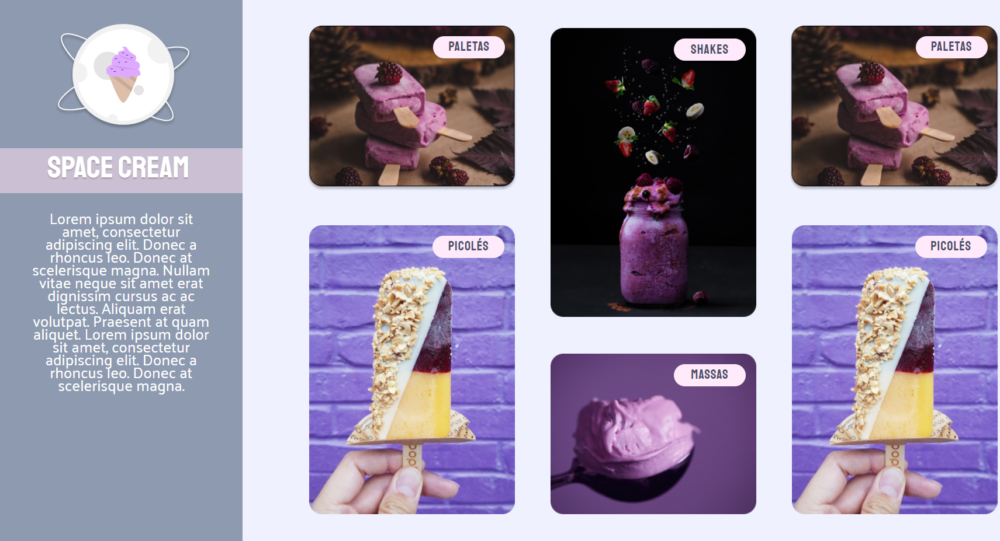
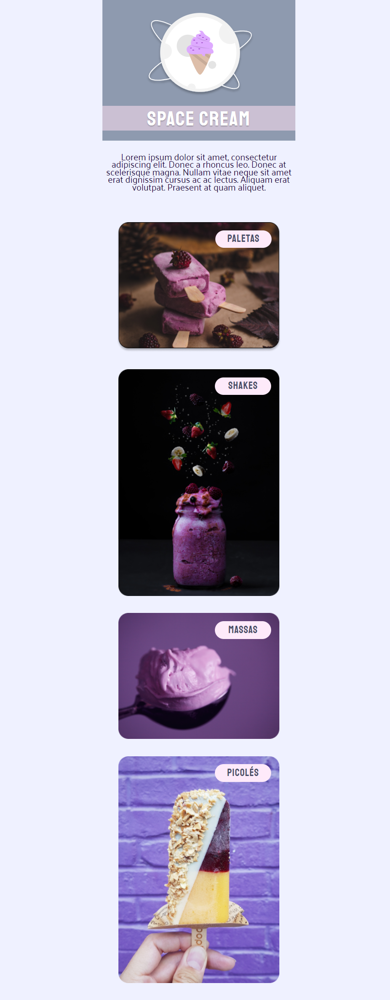

# Projetos-responsivos

## Olá pessoal.

Estes reposítorios se referem a aprendizagem e aplicação do conhecimento de responsividade em tela para Desktop e Mobile.

### Tecnologias
- HTML
- CSS 
  - Responsividade
  - Animação e 
  - Variáveis
- Git e Github
 

### Projetos desenvolvidos: 

> Projeto-SpaceCream-desktop

[Clique aqui para visualização](https://karinewagner.github.io/Projetos-responsivos/projeto-SpaceCream-desktop/)
 
 
 

> Projeto-SpaceCream-mobile

[Clique aqui para visualização](https://karinewagner.github.io/Projetos-responsivos/projeto-SpaceCream-mobile/)
 
 
 

### Projetos complementares de estudo: 

> Animação e variáveis

[Clique aqui para visualização](https://karinewagner.github.io/Projetos-responsivos/Animacao-e-variaveis/)
 
 
 

> Responsividade

[Clique aqui para visualização](https://karinewagner.github.io/Projetos-responsivos/Responsividade/)
 
 
 
